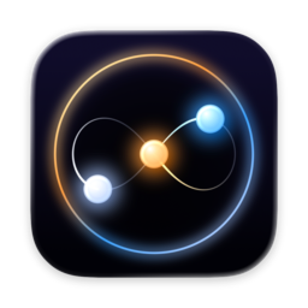

<p align="center">
  
</p>

# Event Horizon

Your other computer, as a Mac app.

Event Horizon puts the gaming PC in the other room inside a Mac window. Home
shows your PC and its games. One click grows the PC into the window, and ⌘W
puts it back on Home while it keeps running. Your cursor moves freely on the
PC's desktop and locks only when you click into a game. On the desktop, ⌘C and
⌘V work the way they work on your Mac.

## What you get

- **The PC as a place in one window.** Home → PC → Home. Swipe or ⌘Tab away at
  any time. No popups take over your Mac.
- **Your pointer stays yours.** It is locked only while a game is in front,
  and freed the moment you swipe or ⌘Tab away.
- **Mac shortcuts on the PC's desktop.** Copy, cut, paste, undo, select all,
  save, find and new tab become their Ctrl versions on the PC. ⌘Tab, ⌘Space and
  ⌘Q stay with your Mac.
- **Your games, on Home.** Each with its own cover, read from the PC.
- **PC setup with one Allow click.** The PC companion (Windows and Linux)
  installs [Sunshine](https://github.com/LizardByte/Sunshine), pairs with your
  Mac when you click Allow on the PC, and keeps the PC awake while you play.
- **A fast engine.** Hardware-decoded H.264, HEVC and AV1 with HDR10. Stereo,
  5.1 and 7.1 audio. Xbox, DualSense and other controllers, with rumble and
  gyro. Wake on LAN, and PCs by address or name (Tailscale works). Tested: HEVC
  at 2560×1600 and 60 fps over home Wi-Fi for 5 hours with 0 dropped frames
  (2026-10-08).

No accounts and no analytics. Event Horizon talks to your own PC and your local
network. Diagnostics are off by default and stay on your Mac.

## Install

**Mac:** macOS 26 or later on Apple Silicon. There is no download yet: build it
from source (below). Signed downloads come with the first release.

**PC:** the companion lives in [`companion/`](companion/); its first release is
coming. Until then, set up Sunshine by hand with
[docs/HOST_SETUP.md](docs/HOST_SETUP.md).

## Build

Xcode 27 or later.

```bash
git clone https://github.com/SolenixAI/event-horizon.git
cd event-horizon
make
```

`make` builds Event Horizon and installs it to /Applications. `make app`
compile-checks, `make test` runs the unit tests, and `make uninstall` removes
it. The PC companion builds with `cargo build --release` in `companion/`.
Start with [docs/ARCHITECTURE.md](docs/ARCHITECTURE.md) and
[docs/CONTRIBUTING.md](docs/CONTRIBUTING.md); agents start with
[AGENTS.md](AGENTS.md).

## Credits and license

Event Horizon is a fork of [Glimmer](https://github.com/Se7enbrc/glimmer)
(Copyright © 2026 ugfugl.io), whose native Swift engine makes it possible. The
transport is ported from
[moonlight-common-c](https://github.com/moonlight-stream/moonlight-common-c)
and [moonlight-qt](https://github.com/moonlight-stream/moonlight-qt). All are
GPLv3, so Event Horizon is too. See [LICENSE](LICENSE) and
[CREDITS.md](CREDITS.md).
