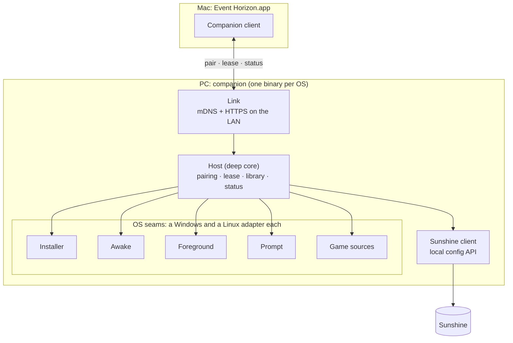

# Event Horizon PC companion: design

The companion turns any gaming PC into an Event Horizon host. It is one
Rust program with one deep core and a Windows and a Linux adapter for each
place where the two systems differ. Both adapters are built together.

**Bar:** a friend goes from solenix.dev to playing a game on their PC from
their Mac in 5 minutes or less, with no help and no terminal.

## The journey it serves

1. On the Mac, Event Horizon finds no PC. It shows "On your PC, open
   solenix.dev/eh" and a 6-letter code.
2. On the PC, the person downloads one installer and runs it. The installer
   installs Sunshine silently, sets its credentials, and starts the
   companion at login.
3. The companion advertises itself on the home network. The Mac finds it.
4. The Mac asks to pair. The PC shows "Allow <Mac name> to use this PC?" with
   the same 6-letter code. One click on **Allow** pairs them.
5. From now on the companion keeps the PC awake while the Mac is connected
   (no blanking, no sleep, no idle auto-lock), tells the Mac what is really
   on screen, and keeps the game shelf in step with the PC's library. A PC
   that was already locked still asks for its password once.

## Modules



### Host: the deep core

One small interface, all the behaviour behind it. `main` per OS builds the
adapters and hands them to `Host::run`; nothing else calls into the core.

```rust
pub struct Ports {
    pub installer: Box<dyn Installer>,
    pub awake: Box<dyn Awake>,
    pub foreground: Box<dyn Foreground>,
    pub prompt: Box<dyn Prompt>,
    pub games: Box<dyn GameSources>,
    pub sunshine: Box<dyn SunshineApi>,
    pub clock: Box<dyn Clock>,
}

impl Host {
    /// Make sure Sunshine is installed and configured, then serve the Mac
    /// until shutdown. Idempotent: a second run repairs, never duplicates.
    pub async fn run(config: Config, ports: Ports, shutdown: Shutdown) -> Result<(), HostError>;

    /// What the Link layer calls. Three requests are the whole protocol.
    pub async fn pair(&self, request: PairRequest) -> PairOutcome;     // needs a click on Allow
    pub async fn lease(&self, mac: &MacId) -> Lease;                   // keeps the PC awake
    pub async fn status(&self, mac: &MacId) -> Status;                 // what is running + library
}
```

Inside the core (internal seams, tested through `Host`):

- **Pairing.** It holds a pending request, asks `Prompt`, and on Allow
  submits the Mac's PIN to Sunshine. Two timers: the companion waits 2
  minutes for a click; Sunshine holds the Mac's started pairing for 5. A
  second request from the same Mac replaces the first. Sunshine matches the
  PIN to the Mac by its pending pairing (`GET /api/pin`, then `POST
  /api/pin` with `pairing_id`, `pin` and `name`).
- **Lease.** The Mac renews a lease every 30 s while it streams. While any
  lease is fresh, the core holds one `Awake` guard. When the last lease is
  older than 90 s, it drops the guard. One guard, not one per Mac.
- **Library sync.** It merges `GameSources` into Sunshine's apps (name, launch
  command, cover art) and leaves apps it did not create alone. It is the
  cross-platform form of the tower's `sunshine-steam-sync` script.
- **Status.** It reports the real foreground app from `Foreground`, mapped
  to a Sunshine app when one matches. This replaces Sunshine's `currentgame`
  as the truth (Sunshine kept reporting a game after only the Desktop ran,
  2026-10-09).

### The OS seams

Each seam has two real adapters (Windows, Linux) and one in-memory fake for
tests, so each is a real seam.

| Seam | Interface | Windows adapter | Linux adapter |
|---|---|---|---|
| `Installer` | `ensure_sunshine() -> SunshineInstall` (idempotent; sets credentials, virtual display, firewall) | Sunshine installer, silent; Virtual Display Driver with `docs/vddsettings.xml` | Flatpak `dev.lizardbyte.app.Sunshine`; user service; uinput setup |
| `Awake` | `hold() -> AwakeGuard` (dropping the guard releases it) | Power request: display + system required (proven: `powercfg /requests` lists it) | `org.freedesktop.ScreenSaver.Inhibit` + login1 `idle:sleep` inhibit, from the desktop session |
| `Foreground` | `current() -> Option<RunningApp>` | `GetForegroundWindow` → process image | KWin over D-Bus (active window → pid → executable) |
| `Prompt` | `ask_allow(mac_name, code) -> Decision` (times out to Deny) | Native dialog from the tray app | KDE notification with actions, fallback dialog |
| `GameSources` | `installed() -> Vec<Game>` | Steam library, Epic, others later | Steam library (native + Flatpak), Jagex launcher |

`SunshineApi` (pin, apps, restart) is the same on both OSes. It has one
real adapter (HTTPS to `localhost:47990` with the credentials the installer
set) plus a fake, so it is an internal seam for tests, not an OS seam.

### Link: the Mac's way in

- **Discovery.** mDNS service `_eventhorizon._tcp` with TXT `v=1`, the
  Sunshine host's unique id, and the companion's certificate fingerprint.
  The Mac matches it to the Sunshine host it already sees.
- **Trust (v1).** Before pairing, only `POST /pair` answers, and it does
  nothing without a click on Allow on the PC and the Mac's Sunshine PIN. On
  Allow the companion gives the Mac a random 256-bit token; it keeps only
  the token's SHA-256, in one file, so a restart keeps every Mac paired.
  `/lease` and `/status` need the token. Later: the same over TLS, with the
  companion's certificate fingerprint in the mDNS TXT record.
- **Protocol.** JSON over HTTPS: `POST /pair`, `POST /lease`, `GET /status`.
  Three requests; versioned by the `v` TXT field.

## Rules learned the hard way

- **One pairing per Mac identity.** Sunshine accepts a client certificate
  only when exactly one paired record matches it (`is_client_enabled`,
  `src/nvhttp.cpp`). Pairing the same Mac twice locks it out until the
  duplicate is removed (seen on the tower, 2026-10-09T19:23-02:30). The Mac
  checks `PairStatus` before it pairs, and never pairs a PC it is paired
  with.
- **No system OpenSSL.** On Linux the companion uses Rust's own TLS; the
  OS's TLS on Windows. Sunshine's local certificate is self-signed, so the
  client accepts it on the loopback address only.
- **Sunshine skips its CSRF check for API clients** (no `Origin` or
  `Referer` header), so the companion needs only its Basic login.

## Errors the core owns

- Sunshine not reachable: the core reinstalls or restarts it once, then
  reports `SunshineDown` in `status`. The Mac shows it on the desk.
- Allow not clicked in 2 minutes: `PairOutcome::Expired`. The Mac offers to
  try again.
- Credentials lost (user reset Sunshine): the installer sets new ones on the
  next run, and pairing still works because the Mac's trust is Sunshine's.

## How it is tested

- `Host` tests use the fakes for every port and a fake clock. They cover
  pairing (Allow, Deny, expiry, replace), lease (hold, renew, release, two
  Macs), library merge (add, keep user apps, remove gone games), and status
  mapping. No OS, no network, no Sunshine.
- Each OS adapter has a small contract test that runs on its own OS in CI:
  free GitHub runners for Windows and Linux.
- One end-to-end test per OS installs the real Sunshine on the runner and
  pairs with a scripted Mac client.

## Build order (test-first, one slice at a time)

1. Workspace + `Host` with fakes: pairing state machine.
2. Lease → `Awake` (both adapters).
3. `SunshineApi` adapter + Link (mDNS, `/pair`), first real pairing from the Mac.
4. `Installer` (both OSes) + the installer packages.
5. `GameSources` + library sync; `Foreground` + status.
6. Mac side: onboarding with the short link and code, lease renewal, status
   on the desk (and the Mac's own Home keep-awake nudge retires).

## Out of v1

Play away from home (needs a relay), macOS hosts, more launchers than Steam
and Jagex, auto-update of the companion (v1 checks and offers).
