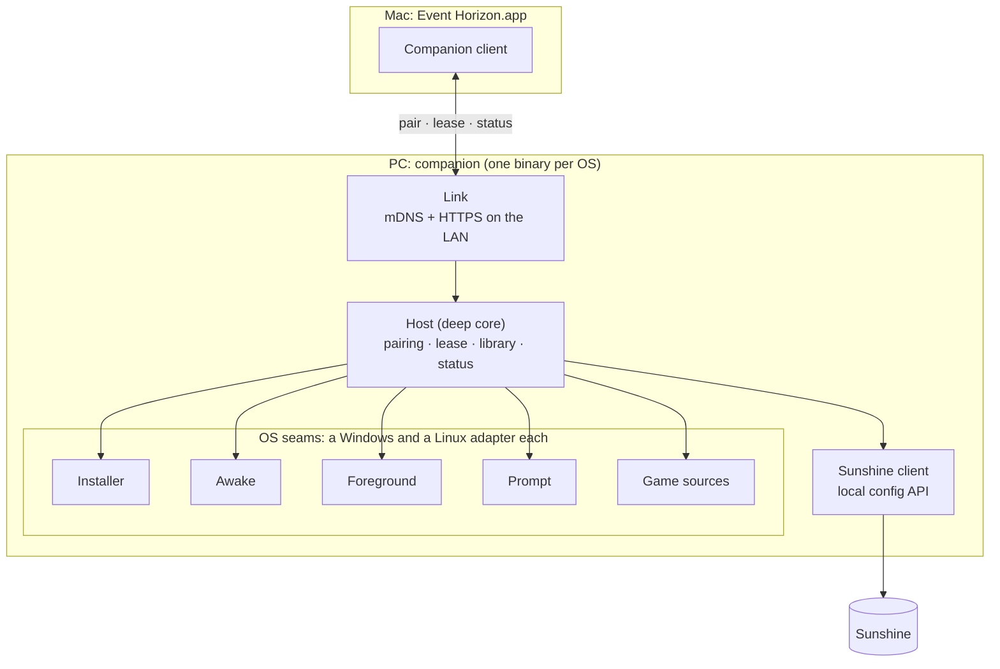

# Event Horizon PC companion: design

The companion turns any gaming PC into an Event Horizon host. It is one
Rust program with one deep core and a Windows and a Linux adapter for each
place where the two systems differ. Both adapters are built together.

**Bar:** a friend goes from solenix.dev to playing a game on their PC from
their Mac in 5 minutes or less, with no help and no terminal.

## The journey it serves

1. On the Mac, Event Horizon finds no PC. It shows "On your PC, open
   solenix.dev/eh" and a 6-letter code.
2. On the PC, the person downloads one installer and runs it. The installer
   installs Sunshine silently, sets its credentials, and starts the
   companion at login.
3. The companion advertises itself on the home network. The Mac finds it.
4. The Mac asks to pair. The PC shows "Allow <Mac name> to use this PC?" with
   the same 6-letter code. One click on **Allow** pairs them.
5. From now on the companion keeps the PC awake while the Mac is connected
   (no blanking, no sleep, no idle auto-lock), tells the Mac what is really
   on screen, and keeps the game shelf in step with the PC's library. A PC
   that was already locked still asks for its password once.

## Modules



### Host: the deep core

One small interface, all the behaviour behind it. `main` per OS builds the
adapters and hands them to `Host::run`; nothing else calls into the core.

```rust
pub struct Ports {
    pub installer: Box<dyn Installer>,
    pub awake: Box<dyn Awake>,
    pub foreground: Box<dyn Foreground>,
    pub prompt: Box<dyn Prompt>,
    pub games: Box<dyn GameSources>,
    pub sunshine: Box<dyn SunshineApi>,
    pub clock: Box<dyn Clock>,
}

impl Host {
    /// Make sure Sunshine is installed and configured, then serve the Mac
    /// until shutdown. Idempotent: a second run repairs, never duplicates.
    pub async fn run(config: Config, ports: Ports, shutdown: Shutdown) -> Result<(), HostError>;

    /// What the Link layer calls. The Link shows `code` to the Mac and the
    /// PC's Allow dialog, then waits for the answer.
    pub async fn pair(&self, request: PairRequest, code: String) -> PairOutcome; // needs a click on Allow
    pub async fn lease(&self, mac: &MacId) -> Lease;                   // keeps the PC awake
    pub async fn status(&self, mac: &MacId) -> Status;                 // what is running + library
}
```

Inside the core (internal seams, tested through `Host`):

- **Pairing.** It holds a pending request, asks `Prompt` with the code, and
  on Allow submits the Mac's PIN to Sunshine. Two timers: the companion waits
  2 minutes for a click; Sunshine holds the Mac's started pairing for 5. A
  second request from the same Mac replaces the first. The Mac's id matches
  the PIN to its pending pairing in Sunshine (`GET /api/pin`, then `POST
  /api/pin` with `pairing_id`, `pin` and `name`).
- **Lease.** The Mac renews a lease every 30 s while it streams. While any
  lease is fresh, the core holds one `Awake` guard. When the last lease is
  older than 90 s, it drops the guard. One guard, not one per Mac.
- **Library sync.** It merges `GameSources` into Sunshine's apps (name, launch
  command, cover art) and leaves apps it did not create alone. It is the
  cross-platform form of the tower's `sunshine-steam-sync` script.
- **Status.** It reports the real foreground app from `Foreground`, mapped
  to a Sunshine app when one matches. This replaces Sunshine's `currentgame`
  as the truth (Sunshine kept reporting a game after only the Desktop ran,
  2026-10-09).

### The OS seams

Each seam has two real adapters (Windows, Linux) and one in-memory fake for
tests, so each is a real seam.

| Seam | Interface | Windows adapter | Linux adapter |
|---|---|---|---|
| `Installer` | `ensure_sunshine() -> SunshineInstall` (idempotent; sets credentials, virtual display, firewall) | Sunshine installer, silent; Virtual Display Driver with `docs/vddsettings.xml` | Flatpak `dev.lizardbyte.app.Sunshine`; user service; uinput setup |
| `Awake` | `hold() -> AwakeGuard` (dropping the guard releases it) | Power request: display + system required (proven: `powercfg /requests` lists it) | `org.freedesktop.ScreenSaver.Inhibit` + login1 `idle:sleep` inhibit, from the desktop session |
| `Foreground` | `current() -> Option<RunningApp>` | `GetForegroundWindow` → process image | KWin over D-Bus (active window → pid → executable) |
| `Prompt` | `ask_allow(mac_name, code) -> Decision` (times out to Deny) | Native dialog from the tray app | KDE notification with actions, fallback dialog |
| `GameSources` | `installed() -> Vec<Game>` | Steam library, Epic, others later | Steam library (native + Flatpak), Jagex launcher |

`SunshineApi` (pin, apps, restart) is the same on both OSes. It has one
real adapter (HTTPS to `localhost:47990` with the credentials the installer
set) plus a fake, so it is an internal seam for tests, not an OS seam.

### Link: the Mac's way in

- **Discovery.** mDNS service `_eventhorizon._tcp` with TXT `v=1` and
  `fp=<SHA-256 of the companion's certificate, DER, in lowercase hex>`. The
  Mac does not browse this service yet, so it learns the fingerprint on
  first use (next bullet).
- **Transport.** HTTPS on TCP 47970 with the companion's own self-signed
  certificate, made on first run and kept as `companion-cert.der` and
  `companion-key.der` beside `macs.json` (the key file is 0600 on Unix). No
  certificate authority: the Mac pins the fingerprint, not a name.
- **Trust (v1).** Trust on first use, then pinned. The Mac trusts the first
  certificate a PC shows and keeps its fingerprint in the Keychain beside
  the token; every later request must show that fingerprint. Pairing trusts
  the PC afresh, because the code on both screens is the check made at that
  moment. A man in the middle during the first pairing could relay the code,
  so that first step has no defence beyond the code check; the TXT record
  closes it once the Mac browses the service.
- **Pairing (two steps).** `POST /pair` with `{mac_id, mac_name, pin?}`
  answers at once with `{code, ticket}`. The code is six random digits. The
  PC shows it on its Allow dialog, with the Mac's name. The Mac shows the
  same code, then waits on `GET /pair/{ticket}` for up to 2 minutes. The
  ticket is random, so only the Mac that asked can collect the answer. On
  Allow the companion gives Sunshine the PIN, and the answer is `{outcome:
  "paired", token}`: a random 256-bit token, of which the companion keeps
  only the SHA-256. The Sunshine PIN goes only over TLS and is never shown
  as the code. A second `POST /pair` from the same Mac replaces the first,
  whose answer is `replaced` (409).
- **Lease.** `POST /lease` with the token keeps the PC awake for 90 s. The
  Mac renews every 30 s.
- **Unpair.** `DELETE /pair` with the Mac's own token removes its record
  here and its client in Sunshine (see Rules). If Sunshine cannot be
  reached, nothing is removed and the answer is 502, so the Mac can try
  again. On the PC, `event-horizon-companion --list-macs` and `--unpair
  <mac id>` do the same without the Link running.
- **Protocol.** JSON over HTTPS: `GET /hello`, `POST /pair`, `GET
  /pair/{ticket}`, `POST /lease`, `DELETE /pair`. Versioned by the `v` TXT
  field and by `/hello`. `GET /status` is the next slice.

## Rules learned the hard way

- **One pairing per Mac identity.** Sunshine accepts a client certificate
  only when exactly one paired record matches it (`is_client_enabled`,
  `src/nvhttp.cpp`). Pairing the same Mac twice locks it out until the
  duplicate is removed (seen on the tower, 2026-10-09T19:23-02:30). The Mac
  checks `PairStatus` before it pairs, and never pairs a PC it is paired
  with.
- **No system OpenSSL.** Sunshine's API uses reqwest: rustls on Linux, the
  OS's TLS on Windows and macOS (dev). Sunshine's local certificate is
  self-signed, so that client accepts it on the loopback address only. The
  Link's server uses rustls on the same provider as reqwest on each OS:
  aws-lc-rs on Linux, ring on Windows and macOS (ring builds without NASM
  or CMake).
- **Sunshine names a pairing by its device name, not a client id.** Its
  pending list (`GET /api/pin`) gives an approval id, a name and an address,
  and nothing that identifies the client. So the Mac names its Sunshine
  pairing with its own id (the `devicename` it sends Sunshine), and the
  companion matches on that id. Two Macs with one display name never match
  each other's pairing. The client is then listed under the display name.
- **Sunshine's client id is its own.** Sunshine gives each paired client a
  random uuid, not the Mac's id, and `GET /api/clients/list` does not show
  which client is which Mac. The companion lists the clients before and after
  a pairing, under one lock, and keeps the new uuid in `macs.json`. Unpair
  posts that uuid to `POST /api/clients/unpair`. A Mac paired with Sunshine
  before the companion has no recorded uuid, so Unpair removes only the
  companion's record; that Sunshine client stays until it is removed in
  Sunshine's own web page.
- **Unpairing the last client ends Sunshine's apps.** Sunshine's unpair
  stops its running apps when no client is left (`src/confighttp.cpp`,
  `unpair`). That is harmless when the last Mac leaves a stream.
- **Sunshine skips its CSRF check for API clients** (no `Origin` or
  `Referer` header), so the companion needs only its Basic login.

## Errors the core owns

- Sunshine not reachable: the core reinstalls or restarts it once, then
  reports `SunshineDown` in `status`. The Mac shows it on the desk.
- Allow not clicked in 2 minutes: `PairOutcome::Expired`. The Mac offers to
  try again.
- Credentials lost (user reset Sunshine): the installer sets new ones on the
  next run, and pairing still works because the Mac's trust is Sunshine's.

## How it is tested

- `Host` tests use the fakes for every port and a fake clock. They cover
  pairing (Allow, Deny, expiry, replace), lease (hold, renew, release, two
  Macs), library merge (add, keep user apps, remove gone games), and status
  mapping. No OS, no network, no Sunshine.
- `Link` tests run the real HTTPS server on a loopback port over the fakes:
  the two-step pairing and its code, replace, lease with the token, unpair
  here and in Sunshine, and a client that pins the advertised fingerprint
  connects while another does not. Sunshine's pending pairings are matched
  by the Mac's id, with two Macs of one display name.
- Each OS adapter has a small contract test that runs on its own OS in CI:
  free GitHub runners for Windows and Linux.
- One end-to-end test per OS installs the real Sunshine on the runner and
  pairs with a scripted Mac client.

## Build order (test-first, one slice at a time)

1. Workspace + `Host` with fakes: pairing state machine.
2. Lease → `Awake` (both adapters).
3. `SunshineApi` adapter + Link (mDNS, `/pair`), first real pairing from the Mac.
4. `Installer` (both OSes) + the installer packages.
5. `GameSources` + library sync; `Foreground` + status.
6. Mac side: onboarding with the short link and code, lease renewal, status
   on the desk (and the Mac's own Home keep-awake nudge retires).

## Out of v1

Play away from home (needs a relay), macOS hosts, more launchers than Steam
and Jagex, auto-update of the companion (v1 checks and offers).
